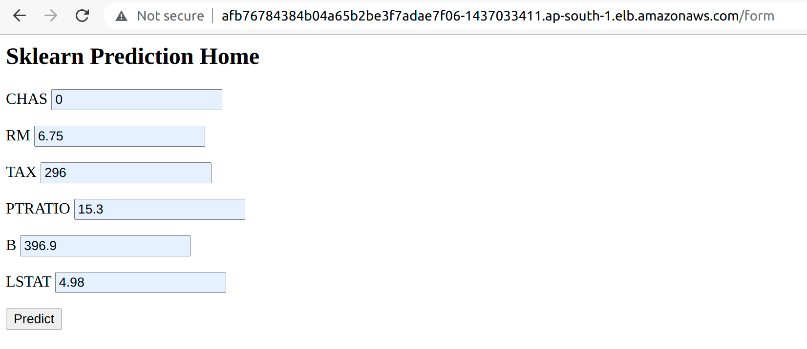

# Udacity-AWS-devops-capstone-project
This contains a simple flask app for k8s deployment in aws infra.

## Project Overview
This capstone project demonstrates the implementation of CI/CD pipeline for deploying a simple flask application to AWS EKS.

### Introduction
This project "operationalize" a sample python/flask app "Deploy a Microservice app with simple front end UI", using CircleCI and a Kubernetes(K8S) cluster deployed in AWS EKS(Amazon Elastic Kubernetes Services).

I have used the flask application from the devops_microservices project as a subject. However, I have modified the app.py code to have a frontend UI for allowing the inputs and the House price prediction result visible in the webpage.

In the CircleCI pipeline, I cover below stages.
 - lint the app.py and Dockerfile
 - build a Docker image and deploy it to a public Docker Registry: Docker Hub
 - create AWS EKS cluster using eksctl
 - deploy the app to the EKS cluster using kubectl
 - Later, we upgrade a new app version to production using a rolling update strategy

### Project Tasks
The project includes the following main tasks:

- Initialize the Python virtual environment: make setup
- Install all necessary dependencies: make install
- Test the app.py code and Dockerfile using pylint & hadolint: make lint

- Create a Dockerfile to "containerize" the flask app: ./run_docker.sh
- Deploy to a public Docker Registry: ./upload_docker.sh

- Deploy a Kubernetes cluster in aws eks using eksctl
- Deploy the flask application to aws eks using kubectl
- Update the app in the cluster, using a rolling-update strategy

The loadbalancer endpoint after successfull deployment into k8s cluster, we can access the application webpage from browser.
Endpoint sample-
"http://loadbalancer_ip:80/form"

The screenshots below show the successful CI/CD pipeline implementation status and also the active webpage of app running in k8s cluster.

### CI/CD Tools and Cloud Services
- Circle CI - Cloud-based CI/CD service
- Amazon AWS - Cloud services provider
- Docker Hub - Container images repository service
- AWS CLI - Command-line tool for AWS
- AWS EKS - Amazon Elastic Kubernetes Services
- AWS eksctl - The official CLI for Amazon EKS
- kubectl - a command-line tool to control Kubernetes clusters

### circleCI Environment Variables
This project needs below mentioned variables defined as env variables in the circleCI project for accomplishing the jobs in pipeline.

- AWS_ACCESS_KEY_ID
- AWS_DEFAULT_REGION
- AWS_SECRET_ACCESS_KEY
- DOCKER_LOGIN
- DOCKER_PASSWORD

